# Agent 4 工作流程图（`RiskAssessmentAgent`）

> 本文件只讲 **Agent 4 一个智能体**。整体系统流程见 [`docs/FLOWCHART.md`](FLOWCHART.md)，
> 开发标准条款对照见 [`docs/AGENT_STANDARD.md`](AGENT_STANDARD.md)，
> Agent 5 见 [`docs/ARCHITECTURE.md`](ARCHITECTURE.md)。
> **图 2 用的是真实运行结果**，复现脚本见文末《图 2 的复现脚本》，可直接复制粘贴运行。
> Mermaid 图在 GitHub、VS Code（Markdown Preview Mermaid Support 扩展）或 <https://mermaid.live>
> 可直接渲染；文末另附图 1 的 ASCII 版本，方便贴进报告/PPT。

---

## 0. 读图前必须记住的 3 件事

| # | 事实 | 含义 |
| --- | --- | --- |
| 1 | **等级只来自 `MaternityRiskRuleEngine`** | LLM 不参与定级；`user_message` 里的"孕周 42 周、阴道出血"不会改变结论，只有结构化进 `state` 才会（`agent4_risk_assessment.py` L319-L322） |
| 2 | **Agent 4 不写共享状态** | 它只产出 `state_update` 增量补丁；真正合并进 `SharedUserState` 的是编排器或会话（`Orchestrator._merge_state_update`） |
| 3 | **HIGH 必然转人工** | `risk_level = HIGH` ⇒ `requires_human = true`（`reprojourney/schemas/risk_rules.py` L140 兜底）⇒ `status = escalate`（`reprojourney/agents/risk/agent4_risk_assessment.py` L329-L330）。这条不依赖提示词，也不可被"说服"绕过 |

---

## 图 1 · Agent 4 完整工作流程

覆盖三条互斥路径：① 入口契约守卫 → ② 越界拒绝 / 正常评估 → ③ 确定性规则引擎（5 组规则 + 取最高 + 两道封顶）
→ ④ `status` / `next_action` 映射 → ⑤ 组装审计事件 / `state_update` / `evidence` → ⑥ 出口契约校验 → 下游 HITL 与治理审计。

```mermaid
flowchart TB
    CALL(["调用方<br/>Orchestrator ｜ assess_risk 工具 ｜ batch_cases.py<br/>await RiskAssessmentAgent().run(agent_input, state=None)"]) --> PREP

    subgraph S1["① 入口守卫 · BaseAgent（标准 §3 / §7）"]
      PREP["prepare_input()<br/>· 入参必须是 AgentInput<br/>· requested_by 必须在词表<br/>· 注入 state 时校验 user_id 一致"] --> PREP_Q{"全部通过？"}
      PREP_Q -->|"否"| PREP_ERR["抛 AgentContractError<br/>宁可报错，不静默降级"]
    end

    PREP_Q -->|"是"| SLEEP["await asyncio.sleep(0)<br/>取 request_id / state / previous_level"]
    SLEEP --> TOPIC_Q{"② _is_off_topic()<br/>当前请求文本命中越界词<br/>且没有任何临床线索？"}

    TOPIC_Q -->|"是 · 路径 1"| REJ["拒绝给出风险结论<br/>status=needs_info · risk_level=UNKNOWN<br/>requires_human=false · next_action 为空列表<br/>state_update 为空字典（不污染共享状态）<br/>审计 action=reject_non_clinical_request"]

    TOPIC_Q -->|"否 · 路径 2 / 3"| E0

    subgraph S2["③ 确定性规则引擎 evaluate(state) —— 唯一决策者，不调用 LLM"]
      E0["初始化<br/>risk_level=UNKNOWN<br/>reasons / rule_ids / needs_info / data_gaps 置空"] --> G1
      G1["孕周<br/>R-GA-01 大于42周 → HIGH<br/>R-GA-02 小于37周且有早产症状 → MODERATE<br/>R-GA-03 小于37周无症状 → LOW<br/>R-GA-04 数据异常 → UNKNOWN"] --> G2
      G2["症状<br/>R-SY-01 高危症状 → HIGH<br/>R-SY-03 腹痛、腹部坠胀 → MODERATE<br/>R-SY-02 需观察症状 → MODERATE<br/>R-SY-04 无法识别，不参与分级 → UNKNOWN"] --> G3
      G3["报告<br/>R-RP-01 高危标记 → HIGH<br/>R-RP-02 需关注标记 → MODERATE<br/>R-RP-03 未识别异常标记 → MODERATE<br/>R-RP-04 缺结构化数据 → UNKNOWN"] --> G4
      G4["病史<br/>R-HX-01 高危病史 → MODERATE"] --> G5
      G5["随访<br/>R-FU-01 超期大于14天 → MODERATE"] --> MERGE
      MERGE["escalate() 逐条登记 rule_id 与原因<br/>等级取最高（UNKNOWN ＜ LOW ＜ MODERATE ＜ HIGH）"] --> CAP_Q{"有 data_gaps 且<br/>当前等级不高于 LOW？"}
      CAP_Q -->|"是"| CAP_UNK["封顶为 UNKNOWN + R-INFO-01<br/>绝不对脏数据下 LOW 结论"]
      CAP_Q -->|"否"| EMPTY_Q
      CAP_UNK --> EMPTY_Q{"reasons 为空？"}
      EMPTY_Q -->|"是"| EMPTY_UNK["UNKNOWN + R-INFO-01<br/>缺少足够的结构化信息，无法做确定性风险判断"]
      EMPTY_Q -->|"否"| OUT
      EMPTY_UNK --> OUT["输出 6 个键<br/>risk_level ｜ reasons ｜ rule_ids<br/>requires_human ｜ needs_info ｜ data_gaps"]
      OUT --> HUMAN["requires_human = risk_level 是否等于 HIGH"]
    end

    HUMAN --> MAP_Q{"④ 输出映射"}
    MAP_Q -->|"risk_level = HIGH"| M_HIGH["status=escalate"]
    MAP_Q -->|"risk_level = UNKNOWN"| M_UNK["status=needs_info<br/>next_action 为空列表"]
    MAP_Q -->|"risk_level = LOW 或 MODERATE"| M_OK["status=success<br/>next_action 指向 governance_audit_agent"]

    M_HIGH --> HITL["HITL 门禁<br/>requires_human=true<br/>调用方必须暂停等人<br/>next_action 指向 request_human_review 与 governance_audit_agent"]
    M_HIGH --> BUILD
    M_UNK --> BUILD
    M_OK --> BUILD

    subgraph S3["⑤ 组装 AgentOutput"]
      BUILD["审计事件（本次恰好 1 条）<br/>action=run_maternity_risk_evaluation<br/>tool_used=maternity_risk_rule_engine<br/>data_accessed = 5 个数据域，受 Agent 5 最小权限表校验"] --> SU["state_update 增量补丁<br/>risk_status 必写<br/>HIGH 且原本无 follow_up 时补一条 15 分钟 SLA 的随访任务"]
      SU --> EV["evidence = 命中规则 ｜ 逐条 reasons<br/>｜ 待补充信息 ｜ 风险等级变化 旧 到 新"]
      EV --> SUM["summary = 等级 + 处置优先级 + 原因"]
    end

    SUM --> ENF{"⑥ enforce_output() 契约校验（标准 §4~§6）<br/>agent 名 ｜ 审计事件 request_id<br/>HIGH ⇒ escalate + requires_human<br/>UNKNOWN ⇒ needs_info<br/>state_update 键必须是一级状态字段"}
    ENF -->|"不合规"| ENF_ERR["抛 AgentContractError"]
    ENF -->|"通过"| DONE(["返回 AgentOutput"])
    REJ --> ENF

    DONE --> DOWN["下游<br/>· state_update 由编排器/会话合并<br/>· requires_human ⇒ HITL 暂停并等人工裁决<br/>· 随后 Agent 5 做治理审计（合规门禁）"]
```



### 节点 ↔ 代码映射（图 1）

| 图 1 节点 | 代码位置 |
| --- | --- |
| 调用 / 唯一入口 `run(agent_input, state=None)` | `reprojourney/agents/risk/agent4_risk_assessment.py` L259 |
| ① 入口守卫：`prepare_input` / `enforce_output` | `reprojourney/agents/base.py` L58-L78 / L80-L87 |
| ② 越界判断 `_is_off_topic` | `reprojourney/agents/risk/agent4_risk_assessment.py` L211（判定点 L287） |
| 路径 1：拒绝出结论 | `reprojourney/agents/risk/agent4_risk_assessment.py` L287-L317 |
| ③ 规则引擎 `evaluate` | `reprojourney/schemas/risk_rules.py` L112-L154 |
| ③ 取最高等级 `escalate()` | `reprojourney/schemas/risk_rules.py` L119-L124 |
| ③ 五组规则调度 | `reprojourney/schemas/risk_rules.py` L126-L130 |
| ③ 脏数据封顶 / 信息不足兜底 / HIGH 兜底 | `reprojourney/schemas/risk_rules.py` L134-L137 / L142-L145 / L140 |
| ③ 规则组明细 | `reprojourney/schemas/risk_rules.py` L157（孕周）、L187（症状）、L209（报告）、L238（病史）、L243（随访） |
| ④ `status` / `next_action` 映射 | `reprojourney/agents/risk/agent4_risk_assessment.py` L327-L341 |
| ⑤ 审计事件 / `state_update` / `summary` / `evidence` | `reprojourney/agents/risk/agent4_risk_assessment.py` L345-L355（审计事件）、L359-L374（`state_update`）、L377（`summary`）、L234（`_evidence`） |
| ⑥ 输出契约校验 | `reprojourney/schemas/agent_contract.py` L396-L404（`assert_output_contract`） |
| 下游 HITL 暂停 | `reprojourney/agents/orchestrator/orchestrator.py` L214-L227 |
| 下游治理审计 | `reprojourney/agents/orchestrator/orchestrator.py` L229-L241；工具层 `reprojourney/tools/registry.py` L402（`assess_risk`） |

---

## 图 2 · 附示例输入的工作流程图（真实运行结果）

示例场景：**过期妊娠 + 阴道出血 + 报告血压异常 + 子痫前期病史**，一次跑满 4 组规则，命中 HIGH 并触发 HITL。
图中所有取值都来自文末脚本的真实输出，未做任何美化。

```mermaid
flowchart TB
    IN(["示例输入 AgentInput<br/>request_id=req-demo-agent4 ｜ task=run_risk_assessment<br/>user_message=孕周 42.8 周，昨天开始阴道出血，今天还有点轻微恶心，报告说血压偏高，我有子痫前期病史<br/>state：孕周 42.8 ｜ 症状 阴道出血、轻微恶心 ｜ 报告 bp_high 为 true、proteinuria 为 false ｜ 病史 子痫前期 ｜ follow_up 为空<br/>context：original_user_msg 同 user_message ｜ audit_events 为空列表<br/>requested_by=orchestrator"]) --> A1

    A1["① prepare_input()<br/>入参是 AgentInput ✓<br/>requested_by 在词表 ✓<br/>未注入第二个 state，沿用 input 里的"] --> A2
    A2{"② _is_off_topic()<br/>文本里有孕周、出血、报告等临床线索<br/>不判为越界"} -->|"false"| A3
    A3["③ 调用 MaternityRiskRuleEngine.evaluate(state)"] --> R1

    R1["孕周规则：42.8 大于 42<br/>→ HIGH · R-GA-01「过期妊娠：孕周大于42周」<br/>该分支立即 return，早产的另外两条规则不再执行"] --> R2
    R2["症状规则：逐条扫描<br/>阴道出血 属于高危症状 → HIGH · R-SY-01<br/>轻微恶心 属于需观察症状 → MODERATE · R-SY-02"] --> R3
    R3["报告规则：逐条扫描 extracted_data<br/>bp_high 的值确实等于 true → HIGH · R-RP-01「报告异常：bp_high」<br/>proteinuria 的值为 false → 直接跳过，不算异常<br/>写成字符串 true 或数字 1 也会被跳过"] --> R4
    R4["病史规则：子痫前期 属于高危病史<br/>→ MODERATE · R-HX-01<br/>当前已是 HIGH，MODERATE 不抬级，但原因与规则号照常记录"] --> R5
    R5["随访规则：follow_up 为空<br/>没有可判断的 overdue_days，本组不命中"] --> R6

    R6["合并：5 条规则登记在案，等级取最高 = HIGH<br/>requires_human = true<br/>data_gaps 为空，不触发 R-INFO-01 封顶<br/>reasons 非空，不走信息不足兜底"] --> R7["引擎输出<br/>risk_level=HIGH<br/>rule_ids = R-GA-01 + R-SY-01 + R-SY-02 + R-RP-01 + R-HX-01"]

    R7 --> M1["④ 映射<br/>status = escalate<br/>next_action = request_human_review 然后 governance_audit_agent"] --> B1
    B1["⑤ 组装输出<br/>审计事件 action=run_maternity_risk_evaluation，human_required=true<br/>evidence 共 6 条：命中规则 + 5 条原因<br/>本例没有待补充信息，也没有风险等级变化（历史 risk_status 为空）"] --> B2
    B2["state_update 两处写入<br/>risk_status：level=HIGH、reasons 5 条、requires_human=true<br/>follow_up：status=pending_human、owner=human_clinician、sla_minutes=15"] --> B3
    B3{"⑥ enforce_output() 契约校验<br/>HIGH 配 escalate ✓ ｜ 审计事件 1 条 ✓<br/>state_update 键都合法 ✓"} -->|"通过"| DONE

    DONE(["返回 AgentOutput<br/>status=escalate ｜ risk_level=HIGH ｜ requires_human=true"]) --> D1["下游<br/>编排器把 risk_status 与 follow_up 合并进 SharedUserState<br/>流程转入 waiting_human：人工 approve、override 或 reject<br/>人工结论落库后，Agent 5 再做治理审计"]
    DONE --> D2["同一份 state 若再跑一次<br/>previous_level 会是 HIGH，evidence 才会多出风险等级变化提示"]

    A3 -.->|"反例：同一句话只说给模型听<br/>整个 state 保持为空"| X1["规则引擎只看结构化字段<br/>五组规则全部不命中<br/>→ reasons 为空<br/>→ UNKNOWN + R-INFO-01<br/>status=needs_info，不转人工"]
```




### 图 2 用到的输入（可直接构造 `AgentInput`）

```python
message = "孕周 42.8 周，昨天开始阴道出血，今天还有点轻微恶心，报告说血压偏高，我有子痫前期病史"

state = SharedUserState(
    user_id="demo-user-042",
    profile=Profile(age=31, basic_profile="pregnant"),
    pregnancy=Pregnancy(gestational_week=42.8, estimated_due_date="2026-10-01"),
    symptoms=[
        Symptom(symptom="阴道出血", severity="high", timestamp="2026-09-16T08:10:00"),
        Symptom(symptom="轻微恶心", severity="low", timestamp="2026-09-16T08:12:00"),
    ],
    reports=[
        Report(
            report_id="lab-001",
            report_type="blood_test",
            extracted_data={"bp_high": True, "proteinuria": False},
            source_file="demo_lab.txt",
        )
    ],
    medical_history=["子痫前期"],
    consent=Consent(
        allow_record_storage=True,
        allow_external_escalation=True,
        allow_family_notification=False,
    ),
)

agent_input = AgentInput(
    request_id="req-demo-agent4",
    user_id=state.user_id,
    task="run_risk_assessment",
    user_message=message,
    state=state,                                              # 唯一分级依据
    context={"original_user_msg": message, "audit_events": []},
    requested_by="orchestrator",
)
```

### 图 2 的真实输出（节选自 `await RiskAssessmentAgent().run(agent_input)`）

```json
{
  "status": "escalate",
  "risk_level": "HIGH",
  "requires_human": true,
  "next_action": ["request_human_review", "governance_audit_agent"],
  "summary": "孕产风险评估完成：HIGH（P0-立即处理）。过期妊娠：孕周大于42周；存在高危症状：阴道出血；存在需要观察的症状：轻微恶心；报告异常：bp_high；存在高危病史：子痫前期",
  "evidence": [
    "命中规则：R-GA-01, R-SY-01, R-SY-02, R-RP-01, R-HX-01",
    "过期妊娠：孕周大于42周",
    "存在高危症状：阴道出血",
    "存在需要观察的症状：轻微恶心",
    "报告异常：bp_high",
    "存在高危病史：子痫前期"
  ],
  "state_update": {
    "risk_status": {
      "level": "HIGH",
      "reasons": [
        "过期妊娠：孕周大于42周",
        "存在高危症状：阴道出血",
        "存在需要观察的症状：轻微恶心",
        "报告异常：bp_high",
        "存在高危病史：子痫前期"
      ],
      "requires_human": true
    },
    "follow_up": {
      "status": "pending_human",
      "owner": "human_clinician",
      "sla_minutes": 15,
      "recommended_action": "立即联系产科医生或前往急诊评估"
    }
  },
  "audit_events": [
    {
      "timestamp": "运行时生成的 UTC 时间戳",
      "request_id": "req-demo-agent4",
      "agent": "risk_assessment_agent",
      "action": "run_maternity_risk_evaluation",
      "data_accessed": ["pregnancy", "symptoms", "reports", "medical_history", "follow_up"],
      "tool_used": "maternity_risk_rule_engine",
      "source": ["shared_user_state"],
      "decision": "risk=HIGH; rules=['R-GA-01', 'R-SY-01', 'R-SY-02', 'R-RP-01', 'R-HX-01']; reasons=5 条原因",
      "risk_level": "HIGH",
      "human_required": true
    }
  ]
}
```

### 图 2 逐节点对照

| 图 2 节点 | 关键代码 | 说明 |
| --- | --- | --- |
| ① 入口守卫 | `reprojourney/agents/base.py` L58-L78 | 三类入参问题都会抛 `AgentContractError` |
| ② 越界判断 | `reprojourney/agents/risk/agent4_risk_assessment.py` L211 | 只看 `user_message` 与 `context["original_user_msg"]` |
| ③ 调用引擎 | `reprojourney/agents/risk/agent4_risk_assessment.py` L322-L325 | 引擎返回 6 个键，Agent 4 用到其中 4 个 |
| 孕周规则 | `reprojourney/schemas/risk_rules.py` L157-L185 | `42.8 > 42` 命中 R-GA-01 后立即 `return` |
| 症状规则 | `reprojourney/schemas/risk_rules.py` L187-L207 | 逐条症状独立判定，互不覆盖 |
| 报告规则 | `reprojourney/schemas/risk_rules.py` L209-L236 | 只认 `value is True`，其余值一律跳过 |
| 病史规则 | `reprojourney/schemas/risk_rules.py` L238-L241 | 只升不降：已是 HIGH 时仅追加原因 |
| 随访规则 | `reprojourney/schemas/risk_rules.py` L243-L247 | 依赖 `follow_up.overdue_days` |
| 合并与两道封顶 | `reprojourney/schemas/risk_rules.py` L119-L145 | 取最高 → 脏数据封顶 → 信息不足兜底 → HIGH 兜底 `requires_human` |
| ④ 映射 | `reprojourney/agents/risk/agent4_risk_assessment.py` L327-L341 | `status` 与 `next_action` 都在这里决定 |
| ⑤ 组装 | `reprojourney/agents/risk/agent4_risk_assessment.py` L345-L355、L359-L374、L234 | 审计事件 / `state_update` / `evidence` 三块互不耦合 |
| ⑥ 出口校验 | `reprojourney/schemas/agent_contract.py` L396-L404 | 违反 §4~§6 直接抛异常，不会返回"半合规"的输出 |


### 复现脚本（把上面这份输出自己重跑一遍）

```python
import asyncio

from reprojourney.agents.risk.agent4_risk_assessment import RiskAssessmentAgent
from reprojourney.schemas.base_schemas import (
    AgentInput, Consent, Pregnancy, Profile, Report, SharedUserState, Symptom,
)


async def main() -> None:
    state = SharedUserState(
        user_id="demo-user-042",
        profile=Profile(age=31, basic_profile="pregnant"),
        pregnancy=Pregnancy(gestational_week=42.8, estimated_due_date="2026-10-01"),
        symptoms=[
            Symptom(symptom="阴道出血", severity="high", timestamp="2026-09-16T08:10:00"),
            Symptom(symptom="轻微恶心", severity="low", timestamp="2026-09-16T08:12:00"),
        ],
        reports=[
            Report(report_id="lab-001", report_type="blood_test",
                   extracted_data={"bp_high": True, "proteinuria": False},
                   source_file="demo_lab.txt")
        ],
        medical_history=["子痫前期"],
        consent=Consent(allow_record_storage=True, allow_external_escalation=True,
                        allow_family_notification=False),
    )
    message = "孕周 42.8 周，昨天开始阴道出血，今天还有点轻微恶心，报告说血压偏高，我有子痫前期病史"

    output = await RiskAssessmentAgent().run(AgentInput(
        request_id="req-demo-agent4",
        user_id=state.user_id,
        task="run_risk_assessment",
        user_message=message,
        state=state,
        context={"original_user_msg": message, "audit_events": []},
        requested_by="orchestrator",
    ))

    print(output.status, output.risk_level, output.requires_human)
    for item in output.evidence:
        print(" -", item)
    print(output.state_update)


if __name__ == "__main__":
    asyncio.run(main())
```

> 期望输出第一行为 `escalate HIGH True`；`evidence` 首项为
> `命中规则：R-GA-01, R-SY-01, R-SY-02, R-RP-01, R-HX-01`；
> `state_update` 恰好两个键：`risk_status` 与 `follow_up`。

---

## 附录 · 图 1 的 ASCII 版

```text
   调用方 await RiskAssessmentAgent().run(agent_input, state=None)
        |
        v  ① BaseAgent.prepare_input()：是 AgentInput？requested_by 合法？user_id 一致？
   +---------------------------- 否 -----------> AgentContractError
   | 是
   v
  ② _is_off_topic()：当前请求文本命中越界词且无临床线索？
   +-- 是（路径 1）--> status=needs_info / risk_level=UNKNOWN / state_update={}
   |                   审计 reject_non_clinical_request -------------------+
   +-- 否（路径 2、3）                                                     |
        v                                                                 |
   ③ MaternityRiskRuleEngine.evaluate(state)   <- 唯一决策者，无 LLM       |
        孕周 R-GA-01/02/03/04 -> 症状 R-SY-01/02/03/04 -> 报告 R-RP-01/02/03/04
            -> 病史 R-HX-01 -> 随访 R-FU-01                               |
        escalate() 逐条登记 rule_id + 原因，等级取最高                     |
        脏数据且等级不高于 LOW -> 封顶 UNKNOWN + R-INFO-01                  |
        reasons 为空           -> UNKNOWN + R-INFO-01                     |
        requires_human = risk_level 是否等于 HIGH                         |
        v                                                                 |
   ④ 映射：HIGH -> escalate | UNKNOWN -> needs_info | 其余 -> success      |
        next_action：escalate -> request_human_review + governance_audit_agent
                     needs_info -> 空 | 其余 -> governance_audit_agent   |
        HIGH -> HITL：调用方必须暂停等人                                    |
        v                                                                 |
   ⑤ 组装：审计事件（恰好 1 条）+ state_update + evidence + summary        |
        v                                                                 |
   ⑥ BaseAgent.enforce_output()（标准 §4~§6）-- 不合规 --> AgentContractError
        | 通过 <---------------------------------------------------------+
        v
   返回 AgentOutput -> 编排器合并 state_update ->（如需）HITL 暂停 -> Agent 5 治理审计
```

