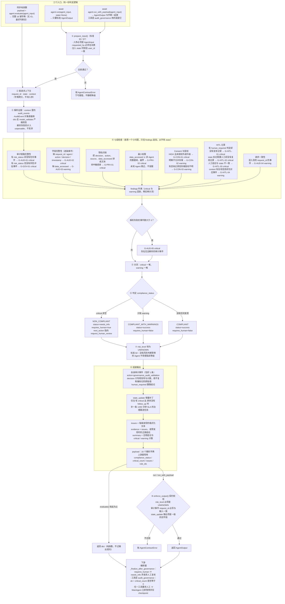

# Agent 5 工作流程图（`GovernanceAuditAgent`）

> 本文件只讲 **Agent 5 一个智能体**。整体系统流程见 [`docs/FLOWCHART.md`](FLOWCHART.md)，
> Agent 4（风险分级）见 [`docs/AGENT4_WORKFLOW.md`](AGENT4_WORKFLOW.md)，
> 开发标准条款对照见 [`docs/AGENT_STANDARD.md`](AGENT_STANDARD.md)。
> **图 2 用的是真实运行结果**（含违规组与对照组两次运行），复现脚本见文末《图 2 的复现脚本》。
> Mermaid 图在 GitHub、VS Code（Markdown Preview Mermaid Support 扩展）或 <https://mermaid.live>
> 可直接渲染；文末另附图 1 的 ASCII 版本。

---

## 0. 读图前必须记住的 4 件事

| # | 事实 | 含义 |
| --- | --- | --- |
| 1 | **Agent 5 不判临床风险** | `risk_duty = False`，`AgentOutput.risk_level` **恒为 `UNKNOWN`**（`agent5_governance_audit.py` L267、L628）。合规结论走 `compliance_status`，所以"审计告警"不可能被前端误读成"临床降级" |
| 2 | **唯一证据来源是 `context["audit_events"]`** | 见 `reprojourney/agents/governance/agent5_governance_audit.py` L577-L579。忘传**不是**"跳过检查"，而是"审计链路为空"——只要 `state` 里有 `risk_status` 就立刻 critical（`G-AUD-01`） |
| 3 | **一条 critical 就拦下整条流程** | 任意 critical ⇒ `NON_COMPLIANT` + `status="needs_info"` + `requires_human=True`（`reprojourney/agents/governance/agent5_governance_audit.py` L605-L611），`next_action` 指向 `request_human_review`。编排器据此把它传导为"需要人工"（`reprojourney/agents/orchestrator/orchestrator.py` L53-L86） |
| 4 | **顺序约束：先写状态，再审计** | 正确顺序是 `Agent 4 → 事件累积 → 写回 state（含人工结论）→ Agent 5`。反过来会命中 `G-HITL-01/02`（缺人工复核记录），人工结论没落库还会命中 `G-HITL-03` |

---

## 图 1 · Agent 5 完整工作流程

覆盖：① 三个入口（同步 `evaluate` / `run` / `run_with_payload`）→ ② 入口契约守卫 → ③ 证据解析（`AuditEvent` 与 `dict` 都收，解析不了的计入 `unparsable`）→ ④ 七组检查 → ⑤ `critical` / `warning` 分流 → ⑥ 三值合规判定 → ⑦ `risk_level` 恒 `UNKNOWN` → ⑧ 组装审计事件 / `state_update` / `issues` / 16 键 payload → ⑨ 出口（`evaluate` 直接返回字典；`run`/`run_with_payload` 过 `enforce_output` 契约校验）→ 下游人工门禁。



### 节点 ↔ 代码映射（图 1）

| 图 1 节点 | 代码位置 |
| --- | --- |
| 三个入口：`evaluate` / `run` / `run_with_payload` | `reprojourney/agents/governance/agent5_governance_audit.py` L557 / L730 / L697 |
| ① 入口守卫（仅 `run` / `run_with_payload` 走） | `reprojourney/agents/base.py` L58-L78 / L80-L87 |
| ② 取请求上下文 | `reprojourney/agents/governance/agent5_governance_audit.py` L572-L574 |
| ③ 证据解析 + `unparsable` | agent5_governance_audit.py L577-L579；解析函数 `_as_event` L176 |
| ④-1 审计链路完整性 | agent5_governance_audit.py L297（`G-AUD-01` 判定 L307、`G-GOV-01` 判定 L316）；动作白名单 `RISK_AUDIT_ACTIONS` L79 |
| ④-2 字段完整性 | agent5_governance_audit.py L329（`G-AUD-02` 判定 L341、`G-AUD-03` 判定 L350）；必填字段表 `REQUIRED_AUDIT_FIELDS` L84 |
| ④-3 隐私扫描 | agent5_governance_audit.py L361（判定 L380）；敏感串表 `SENSITIVE_TOKENS` L88 |
| ④-4 最小权限 | agent5_governance_audit.py L391（判定 L405、未知 Agent 跳过 L401-L403）；权限表 `AGENT_DATA_SCOPE` L95 |
| ④-5 Consent 与授权 | agent5_governance_audit.py L439（`G-CON-01` L456、`G-CON-02` L467、`G-CON-03` L477） |
| ④-6 HITL 记录 | agent5_governance_audit.py L491（复核事件筛选 L508、判定事件筛选 L509、`G-HITL-01` L511、`G-HITL-02` L520、`G-HITL-03` L536、`G-HITL-04` L545）；人工动作白名单 `HUMAN_REVIEW_ACTIONS` L81 |
| ④-7 请求一致性 | agent5_governance_audit.py L416（判定 L427-L428） |
| ④ 七组检查的调用顺序 | agent5_governance_audit.py L582-L589 |
| ⑤ 解析失败 → `G-AUD-05` | agent5_governance_audit.py L591-L599 |
| ⑥ `critical` / `warning` 分流与判定 | agent5_governance_audit.py L602-L621 |
| ⑦ `risk_level` 恒 `UNKNOWN` | agent5_governance_audit.py L628（`risk_duty = False` 见 L267） |
| ⑧ 审计事件 / `state_update` / `issues` / payload | agent5_governance_audit.py L634（`decision_text`）、L645（审计事件）、L659（`state_update`）、L669（`issues`）、L675（返回 16 键字典） |
| ⑨ 出口契约校验 | `reprojourney/schemas/agent_contract.py` L396-L404（`assert_output_contract`） |
| 下游：编排器传导 `requires_human` | `reprojourney/agents/orchestrator/orchestrator.py` L53-L86（`_finalize_after_governance`） |
| 下游：工具层 `audit_governance`（`ok = critical_count == 0`） | `reprojourney/tools/registry.py` L445-L486（成功判定 L471） |

---

## 图 2 · 附示例输入的工作流程图（真实运行结果）

示例场景：**Agent 4 已判 HIGH、人工已复核落库，但用户没有授权"外部升级"**。
七组检查里只有 Consent 那一组失守（一条 critical），其余六组全部通过——足以把流程判为不合规。
图中所有取值都来自文末脚本的真实输出。

```mermaid
flowchart TB
    IN(["示例输入 AgentInput<br/>request_id=req-demo-agent5 ｜ task=run_governance_audit ｜ requested_by=orchestrator<br/>state：孕周 42.8 ｜ 症状 阴道出血 ｜ 病史 子痫前期<br/>risk_status：level=HIGH，requires_human=false（人工已复核并写回状态）<br/>consent：allow_record_storage=true，allow_external_escalation=false<br/>consultation_history 为空 ｜ follow_up 为空<br/>context：audit_events 两条 + human_review={action: approve, revised_risk_level: HIGH}"]) --> A1

    A1["① evaluate()：同步纯函数，无 IO"] --> A2
    A2["② 证据解析：两条事件都是 dict<br/>· risk_assessment_agent 的 run_maternity_risk_evaluation<br/>· main_agent 的 human_risk_review<br/>两条都通过 model_validate → unparsable = 0"] --> K1

    K1["④-1 审计链路：有 risk_status，事件非空，且含风险评估事件<br/>→ 通过"] --> K2
    K2["④-2 字段完整性：两条事件五个必填字段齐全，data_accessed 非空<br/>→ 通过"] --> K3
    K3["④-3 隐私扫描：decision 里只有规则号与原因，没有敏感串<br/>→ 通过"] --> K4
    K4["④-4 最小权限：risk 事件访问 5 个数据域（全在其允许域内）<br/>main_agent 事件访问 risk_status（在其允许域内）<br/>→ 通过"] --> K5
    K5["④-5 Consent：level=HIGH 且 allow_external_escalation=false<br/>→ 命中 G-CON-01（critical）<br/>allow_record_storage=true → 不命中 G-CON-02<br/>consultation_history 为空 → 不命中 G-CON-03"] --> K6
    K6["④-6 HITL：存在 human_required 判定，且有人工复核事件<br/>state.requires_human=false，human_review 的 HIGH 与 state 一致<br/>→ 通过"] --> K7
    K7["④-7 请求一致性：两条事件 request_id 都是 req-demo-agent5<br/>→ 通过"] --> SUM

    SUM["⑤ 汇总：critical = 1（仅 G-CON-01），warnings = 0<br/>unparsable = 0，因此不追加 G-AUD-05"] --> V
    V["⑥ 判定：critical 非空 → NON_COMPLIANT<br/>status=needs_info ｜ requires_human=true<br/>risk_level 仍恒为 UNKNOWN"] --> B1
    B1["⑧ 组装审计事件<br/>action=governance_audit_validation<br/>decision=compliance=NON_COMPLIANT; policy=governance-audit/v1.0;<br/>events_checked=2; critical=1; warnings=0; rules=G-CON-01:critical"] --> B2
    B2["state_update：原本没有 follow_up → 补一条治理跟进任务<br/>status=pending_governance_review，owner=governance_officer，sla_minutes=1440<br/>issues 与 evidence = [critical] G-CON-01｜高风险场景未取得外部升级授权"] --> DONE

    DONE(["返回 status=needs_info ｜ risk_level=UNKNOWN ｜ requires_human=true<br/>next_action 指向 request_human_review"]) --> D1["下游<br/>编排器把结论传导为 needs_info 并请求人工<br/>工具层 audit_governance 的 ok=false ⇒ MainAgent 立即暂停并存 checkpoint"]
    DONE --> D2["注意：Agent 5 不改写风险等级<br/>HIGH 仍是 Agent 4 的结论，这里只是拒绝放行"]

    K5 -.->|"对照组：把 allow_external_escalation 改成 true"| X1["七组检查零发现<br/>→ COMPLIANT，status=success，requires_human=false<br/>state_update 为空字典<br/>evidence = 审计链路完整：2 个审计事件通过校验"]
```




### 图 2 用到的输入（Agent 5 只吃 `state` + `context`，不吃自然语言）

```python
REQUEST_ID = "req-demo-agent5"

# Agent 4 跑完后累积进链路的一条（注意 human_required=true：它把 HITL 义务写进了审计）
RISK_EVENT = {
    "request_id": REQUEST_ID,
    "agent": "risk_assessment_agent",
    "action": "run_maternity_risk_evaluation",
    "data_accessed": ["pregnancy", "symptoms", "reports", "medical_history", "follow_up"],
    "tool_used": "maternity_risk_rule_engine",
    "source": ["shared_user_state"],
    "decision": "risk=HIGH; rules=['R-GA-01', 'R-SY-01', 'R-HX-01']; reasons=2 条",
    "risk_level": "HIGH",
    "human_required": True,
}

# 人工复核落库后追加的一条（main_agent 写入）
REVIEW_EVENT = {
    "request_id": REQUEST_ID,
    "agent": "main_agent",
    "action": "human_risk_review",
    "data_accessed": ["risk_status"],
    "source": ["human"],
    "decision": "reviewer=dr-wang; action=approve; old_risk=HIGH; new_risk=HIGH",
    "risk_level": "HIGH",
    "human_required": False,
}

HUMAN_REVIEW = {"action": "approve", "revised_risk_level": "HIGH"}

state = SharedUserState(
    user_id="demo-user-042",
    pregnancy=Pregnancy(gestational_week=42.8),
    symptoms=[Symptom(symptom="阴道出血", severity="high")],
    medical_history=["子痫前期"],
    risk_status=RiskStatus(level="HIGH", requires_human=False),   # 人工已复核，故为 false
    consent=Consent(
        allow_record_storage=True,
        allow_external_escalation=False,                          # ← 本例的违规点
        allow_family_notification=False,
    ),
)

agent_input = AgentInput(
    request_id=REQUEST_ID,
    user_id=state.user_id,
    task="run_governance_audit",
    user_message="请检查审计与合规",     # 本 Agent 不读它，只是标准 §3 的必填字段
    state=state,
    context={"audit_events": [RISK_EVENT, REVIEW_EVENT], "human_review": HUMAN_REVIEW},
    requested_by="orchestrator",
)
```

### 图 2 的真实输出（违规组：`allow_external_escalation=False`）

```json
{
  "compliance_status": "NON_COMPLIANT",
  "policy_version": "governance-audit/v1.0",
  "events_checked": 2,
  "critical_count": 1,
  "warning_count": 0,
  "issues": ["[critical] G-CON-01｜高风险场景未取得外部升级授权"],
  "findings": [
    {
      "rule_id": "G-CON-01",
      "severity": "critical",
      "message": "高风险场景未取得外部升级授权",
      "subject": "consent.allow_external_escalation"
    }
  ],
  "rule_ids": ["G-CON-01"],
  "status": "needs_info",
  "risk_level": "UNKNOWN",
  "requires_human": true,
  "summary": "治理审计完成：NON_COMPLIANT（critical=1, warnings=0）。",
  "evidence": ["[critical] G-CON-01｜高风险场景未取得外部升级授权"],
  "next_action": ["request_human_review"],
  "state_update": {
    "follow_up": {
      "status": "pending_governance_review",
      "owner": "governance_officer",
      "sla_minutes": 1440,
      "recommended_action": "人工复核合规问题并完成授权确认"
    }
  },
  "audit_event": {
    "timestamp": "运行时生成的 UTC 时间戳",
    "request_id": "req-demo-agent5",
    "agent": "governance_audit_agent",
    "action": "governance_audit_validation",
    "data_accessed": ["risk_status", "consent", "audit_events"],
    "tool_used": null,
    "source": ["shared_user_state", "orchestrator"],
    "decision": "compliance=NON_COMPLIANT; policy=governance-audit/v1.0; events_checked=2; critical=1; warnings=0; rules=G-CON-01:critical",
    "risk_level": "UNKNOWN",
    "human_required": true
  }
}
```

### 对照组（唯一差别：`allow_external_escalation=True`）

```json
{
  "compliance_status": "COMPLIANT",
  "events_checked": 2,
  "critical_count": 0,
  "warning_count": 0,
  "issues": [],
  "rule_ids": [],
  "status": "success",
  "risk_level": "UNKNOWN",
  "requires_human": false,
  "summary": "治理审计完成：COMPLIANT（critical=0, warnings=0）。",
  "evidence": ["审计链路完整：2 个审计事件通过校验"],
  "next_action": [],
  "state_update": {}
}
```

> 对照着看：**同一个高风险案例、同一个审计链路，只差一个授权位**，结论就从"拦下并转人工"变成"放行"。
> 这正是 Agent 5 的职责边界——它不评价风险高低（那永远是 HIGH），只评价"这次处置合不合规"。


### 图 2 逐节点对照

| 图 2 节点 | 关键代码（下表 `agent5_governance_audit.py` = `reprojourney/agents/governance/agent5_governance_audit.py`） | 说明 |
| --- | --- | --- |
| ① `evaluate()` | `reprojourney/agents/governance/agent5_governance_audit.py` L557 | 同步纯函数；`run()` 只是它的包装（L730） |
| ② 证据解析 | agent5_governance_audit.py L577-L579、L176 | `dict` 经 `model_validate`；解析失败不丢弃，计入 `unparsable` |
| ④-1 审计链路 | agent5_governance_audit.py L297-L327 | 判据是 `state.risk_status` 与 `RISK_AUDIT_ACTIONS`（L79） |
| ④-2 字段完整性 | agent5_governance_audit.py L329-L359 | 判据是 `REQUIRED_AUDIT_FIELDS`（L84） |
| ④-3 隐私扫描 | agent5_governance_audit.py L361-L389 | 判据是 `SENSITIVE_TOKENS`（L88），只看四个文本字段 |
| ④-4 最小权限 | agent5_governance_audit.py L391-L414 | 判据是 `AGENT_DATA_SCOPE`（L95）；未知 Agent 跳过（L401-L403） |
| ④-5 Consent | agent5_governance_audit.py L439-L489 | 本例唯一命中：`risk_status.level == HIGH` 且 `allow_external_escalation is not True`（L456-L457） |
| ④-6 HITL | agent5_governance_audit.py L491-L554 | 本例通过：有 `human_required` 判定也有复核事件（L508-L519），结论与 `state` 一致（L536） |
| ④-7 请求一致性 | agent5_governance_audit.py L416-L437 | 事件 `request_id` 与输入不一致才报（L427-L428） |
| ⑤ 汇总 | agent5_governance_audit.py L602-L604 | 按 `is_critical` 分流（`GovernanceFinding.is_critical` L144） |
| ⑥ 判定 | agent5_governance_audit.py L605-L621 | critical → `NON_COMPLIANT` + `needs_info` + `requires_human` |
| ⑦ `risk_level` | agent5_governance_audit.py L628、L267 | 恒 `UNKNOWN`（`risk_duty = False`） |
| ⑧ 组装 | agent5_governance_audit.py L634（`decision_text`）、L645（审计事件）、L659（`state_update`）、L669（`issues`）、L675（payload） | 审计事件只记规则号与计数，不回显原始值 |
| 下游 | `reprojourney/agents/orchestrator/orchestrator.py` L53-L86；`reprojourney/tools/registry.py` L445-L486 | 编排器按 `requires_human` 传导；工具层用 `critical_count == 0` 判定工具是否成功 |

### 图 2 的复现脚本（两组一起跑，控制台直接打印结论）

```python
from reprojourney.agents.governance.agent5_governance_audit import GovernanceAuditAgent
from reprojourney.schemas.base_schemas import (
    AgentInput, Consent, Pregnancy, RiskStatus, SharedUserState, Symptom,
)

REQUEST_ID = "req-demo-agent5"

RISK_EVENT = {
    "request_id": REQUEST_ID,
    "agent": "risk_assessment_agent",
    "action": "run_maternity_risk_evaluation",
    "data_accessed": ["pregnancy", "symptoms", "reports", "medical_history", "follow_up"],
    "tool_used": "maternity_risk_rule_engine",
    "source": ["shared_user_state"],
    "decision": "risk=HIGH; rules=['R-GA-01', 'R-SY-01', 'R-HX-01']; reasons=2 条",
    "risk_level": "HIGH",
    "human_required": True,
}

REVIEW_EVENT = {
    "request_id": REQUEST_ID,
    "agent": "main_agent",
    "action": "human_risk_review",
    "data_accessed": ["risk_status"],
    "source": ["human"],
    "decision": "reviewer=dr-wang; action=approve; old_risk=HIGH; new_risk=HIGH",
    "risk_level": "HIGH",
    "human_required": False,
}

HUMAN_REVIEW = {"action": "approve", "revised_risk_level": "HIGH"}


def build_state(*, allow_external_escalation: bool) -> SharedUserState:
    return SharedUserState(
        user_id="demo-user-042",
        pregnancy=Pregnancy(gestational_week=42.8),
        symptoms=[Symptom(symptom="阴道出血", severity="high")],
        medical_history=["子痫前期"],
        risk_status=RiskStatus(level="HIGH", requires_human=False),
        consent=Consent(
            allow_record_storage=True,
            allow_external_escalation=allow_external_escalation,
            allow_family_notification=False,
        ),
    )


def audit(state: SharedUserState) -> dict:
    return GovernanceAuditAgent().evaluate(
        AgentInput(
            request_id=REQUEST_ID,
            user_id=state.user_id,
            task="run_governance_audit",
            user_message="请检查审计与合规",
            state=state,
            context={"audit_events": [RISK_EVENT, REVIEW_EVENT], "human_review": HUMAN_REVIEW},
            requested_by="orchestrator",
        )
    )


for label, allow in (("违规组 allow_external_escalation=False", False),
                     ("对照组 allow_external_escalation=True ", True)):
    payload = audit(build_state(allow_external_escalation=allow))
    print(f"{label} -> status={payload['status']} risk_level={payload['risk_level']} "
          f"requires_human={payload['requires_human']} critical={payload['critical_count']} "
          f"warnings={payload['warning_count']} compliance={payload['compliance_status']}")
    print("   issues:", payload["issues"] or "(无)")
    print("   state_update:", payload["state_update"])
```

> 期望输出：
> `违规组 … -> status=needs_info risk_level=UNKNOWN requires_human=True critical=1 warnings=0 compliance=NON_COMPLIANT`，
> `issues` 为 `[critical] G-CON-01｜高风险场景未取得外部升级授权`，`state_update` 含 `follow_up`；
> `对照组 … -> status=success risk_level=UNKNOWN requires_human=False critical=0 warnings=0 compliance=COMPLIANT`，
> `issues` 为空，`state_update` 为空字典。


---

## 附录 · 图 1 的 ASCII 版

```text
   三个入口：evaluate(agent_input) -> dict   |   run(...) / run_with_payload(...) -> AgentOutput
        |                                         |
        |                                    ① prepare_input()：AgentInput？requested_by 合法？user_id 一致？
        |                                         +------- 否 ------> AgentContractError
        v                                         v 是
   ② 取 request_id / state / context（字典拷贝，不改入参）
        v
   ③ 解析证据 context["audit_events"]：对象直接用，dict 走 model_validate，失败计入 unparsable
        v
   ④ 七组检查（各自 append 到 findings，从不改 state）
        +- 审计链路：有 risk_status 无事件 -> G-AUD-01；无风险评估事件 -> G-GOV-01      (critical)
        +- 字段完整性：缺必填字段 -> G-AUD-02 (critical)；缺 data_accessed -> G-AUD-03 (warning)
        +- 隐私：命中敏感串 -> G-PRV-01                                                (critical)
        +- 最小权限：越界数据域 -> G-PRV-02；未知 Agent 跳过                             (critical)
        +- Consent：HIGH 未授权外部升级 -> G-CON-01                                    (critical)
        |            不允许存储 -> G-CON-02；有咨询记录但授权不明 -> G-CON-03           (warning)
        +- HITL：有判定无复核 -> G-HITL-01；state 要人无复核 -> G-HITL-02               (critical)
        |        人工结论与 state 不一致 -> G-HITL-03；有信息无事件 -> G-HITL-04         (warning)
        +- 请求一致性：混入别的 request_id -> G-AUD-04                                 (warning)
        +- 解析失败的事件数大于 0 -> G-AUD-05                                           (critical)
        v
   ⑤ 分流 critical / warning
        v
   ⑥ 判定：critical 非空 -> NON_COMPLIANT + needs_info + requires_human
            只有 warning -> COMPLIANT_WITH_WARNINGS + success
            零发现       -> COMPLIANT + success
        v
   ⑦ risk_level 恒为 UNKNOWN（没有风险判断职责，不得报临床等级）
        v
   ⑧ 组装：审计事件 governance_audit_validation（只记规则号与计数）
           state_update：仅 critical 且原本无 follow_up 时补治理跟进任务（1440 分钟）
           issues / evidence / summary / payload（16 键）
        v
   ⑨ 出口：evaluate 直接返回 dict；run / run_with_payload 过 enforce_output()（标准 §4~§6）
        v
   下游：编排器 requires_human ⇒ needs_info 并请求人工；工具层 ok = critical_count 是否等于 0
        ⇒ MainAgent 立即暂停存 checkpoint，等人裁决
```

