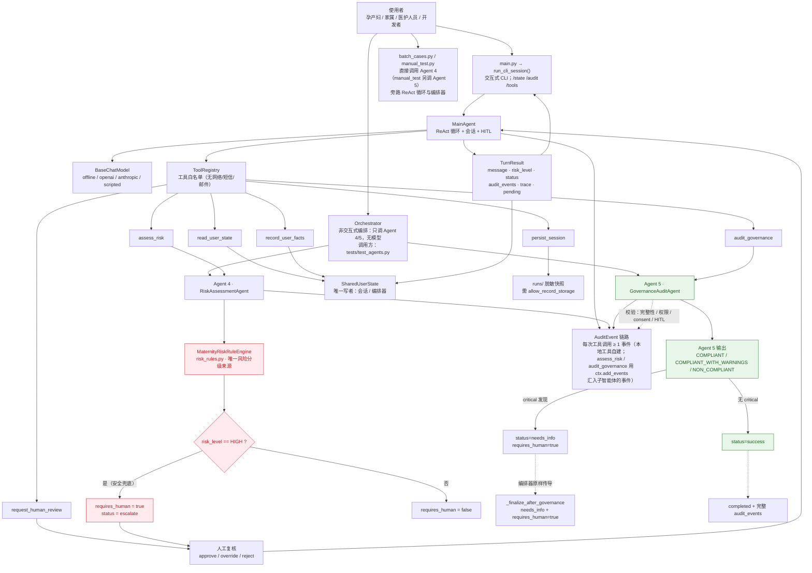
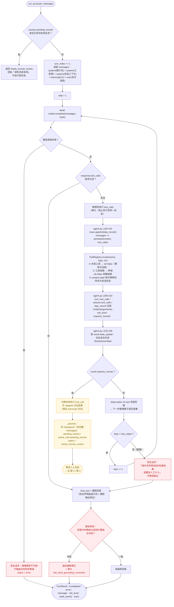
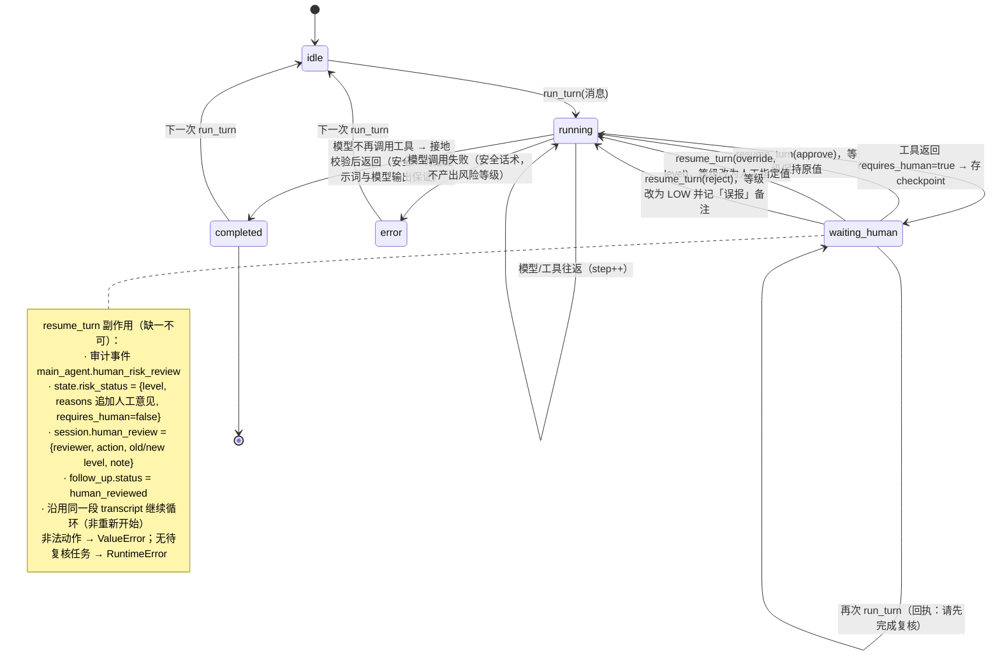
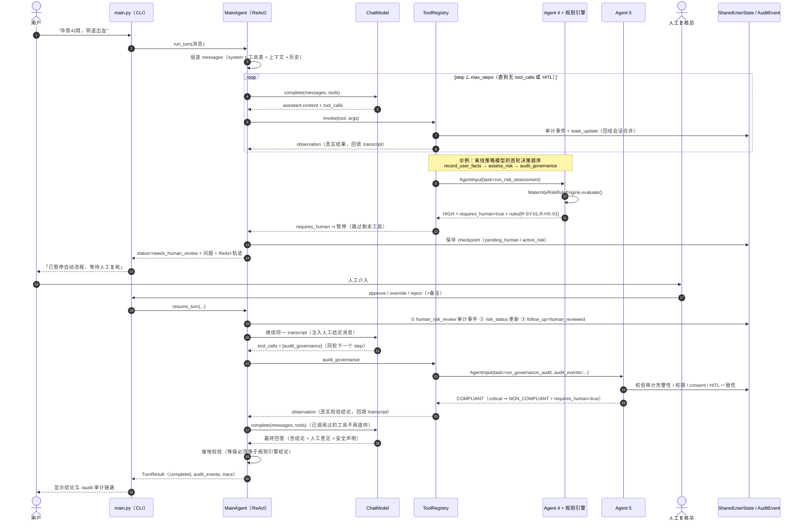
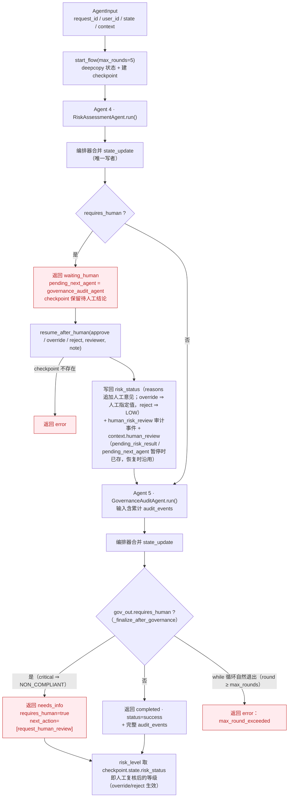
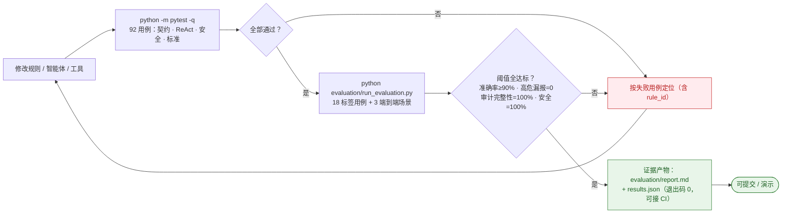

# ReproJourney 整体流程图

所有流程均**逐节点对应仓库中的真实实现**，末尾附「节点 ↔ 代码映射表」；
逐条核验过程与结论见「图 ↔ 代码一致性核验（逐节点审计记录）」一节。
开发标准（v1.0）的条款 ↔ 代码对照与偏差登记见 `docs/AGENT_STANDARD.md`。
Mermaid 图在 GitHub、VS Code（Markdown Preview Mermaid Support 扩展）或
<https://mermaid.live> 可直接渲染；文末另附纯 ASCII 版本，方便直接粘贴进报告/PPT。

---

## 图 0 · 一页总览（ASCII）

```text
                ┌──────────────────────── 用户 ────────────────────────┐
                │  "孕周42周，阴道出血"   /  approve  /  override  /  reject │
                └───────────────┬──────────────────────┬──────────────┘
                                │                      │ 人工复核结论
                     main.py →  ▼                      ▼
        ┌───────────────────────────────────────────────────────────────┐
        │  MainAgent（真实 ReAct 循环 + 会话/HITL 存档）                  │
        │  ┌─ Thought ───────────▶ 模型输出 content + tool_calls         │
        │  ├─ Action  ───────────▶ ToolRegistry 按名分发（每次调用留审计）│
        │  ├─ Observation ──────▶ 真实结果回填 transcript（grounding）   │
        │  ├─ 状态合并 ─────────▶ 会话是 SharedUserState 唯一写者         │
        │  ├─ HITL 门禁 ────────▶ requires_human ⇒ 暂停 + checkpoint      │
        │  └─ Final ────────────▶ 接地校验（等级须等于规则引擎结论）      │
        └───────┬──────────────┬──────────────┬──────────────┬─────────┘
                │              │              │              │
        read/record      assess_risk    audit_governance   request_human_review
                │              │              │          persist_session
                ▼              ▼              ▼              ▼
        SharedUserState  ┌───────────┐  ┌──────────────┐  人工 / runs/ 脱敏快照
        （仅供读取）      │ Agent 4   │  │  Agent 5     │
                        │ + 规则引擎│  │ 治理与审计    │
                        │ 唯一分级  │  │ 审计完整性    │
                        └─────┬─────┘  │ 权限/Consent  │
                              │        │ HITL 记录一致性│
                     HIGH ⇒ requires_human └──────┬──────┘
                              └───────────────────┴──▶ AuditEvent 链路（可追溯）
```

> 两条**旁路入口**（不在上图主链路内，见 图 1）：`batch_cases.py` / `manual_test.py` 直接
> 调用 Agent 4（`manual_test.py` 另调 Agent 5），不经 ReAct 循环；`Orchestrator` 由
> `tests/test_agents.py` 驱动，只编排 Agent 4 → 人工 → Agent 5。
> “安全声明”不是 `agent.py` 追加的，而是提示词（`prompts.py` L37）与模型输出
> （`offline_chat.py::_compose_final_answer`）保证；`agent.py::_finalize` 仅在空文本时填兜底话术。

---

## 图 1 · 组件与数据流总览



---

## 图 2 · 单回合 ReAct 循环（含 HITL 暂停分支）

对应 `reprojourney/agents/main_agent/agent.py::MainAgent._run_loop`。



---

## 图 3 · HITL 状态机

对应 `run_turn` / `_pause` / `resume_turn`，以及 `session.py` 中的 `SessionState`。



---

## 图 4 · 端到端时序（高危 → 人工复核 → 合规）



---

## 图 5 · Orchestrator 批量路径（无模型，确定性编排）

对应 `reprojourney/agents/orchestrator/orchestrator.py`。



---

## 图 6 · 开发与验证流水线（规则/代码变更的准入流程）



---

## 图表校验与预览

- **预览**：GitHub 直接渲染 Mermaid；VS Code 安装 “Markdown Preview Mermaid Support” 扩展后
  按 `Ctrl+Shift+V`；也可把代码块粘贴到 <https://mermaid.live>。
- **校验（可选）**：`docs/check_flowchart.mjs` 用 Mermaid 官方解析器逐图 `parse`，
  有任何语法错误即退出码 1。本文档当前 6 张图均已通过校验
  （`flowchart-v2` × 4、`stateDiagram` × 1、`sequence` × 1）：

  ```powershell
  npm i mermaid@11 jsdom@24                    # 任意目录安装一次（仓库本身不依赖 Node）
  $env:MERMAID_DEPS = "<含 node_modules 的目录>"
  node docs/check_flowchart.mjs docs/FLOWCHART.md
  ```

- **文档断言守卫（可选）**：`docs/check_docs.py` 用纯标准库，把本文件与 `README.md` 里
  “可被代码证伪”的断言逐条对照源码 —— 测试总数与拆分、工具白名单、`R-*` / `G-*` rule_id 目录、
  评估阈值与语料规模、`max_react_steps` / `max_rounds` 默认值、图的数量与类型，
  以及本文档引用的行号与符号是否仍落在代码里；与代码不符即退出码 1：

  ```powershell
  python docs/check_docs.py                    # 无需安装任何依赖
  ```

---

## 图 ↔ 代码一致性核验（逐节点审计记录）

每张图都不是凭记忆画的，而是对着代码逐节点核对。核验方式与偏差如下：

| 图 | 核验方式 | 结论 |
| --- | --- | --- |
| 图 0 / 图 1 | 逐节点 `grep` 到具体文件/函数：`main.py`、`registry.py::build_default_registry`（6 个工具名）、`risk_rules.py::evaluate`（`requires_human = risk_level == "HIGH"`，L140）、Agent 4/5 的 `status` 取值 | 修正 3 处：入口归属（batch/manual 直连 Agent 4/5，不走编排器）、审计事件来源、Agent 5 结论到编排器的传导 |
| 图 2 | 对照 `agent.py::_run_loop` 行号：L184-191（trace/assistant 落 transcript）、L193（无 tool_calls 收敛）、L200-223（逐调用 `invoke` + 记账）、L203（`context.state` 同步）、L225-228（会话合并）、L230-247（HITL 暂停 + skipped 占位） | 修正 1 处：`assistant(tool_calls)` 入 transcript 属于循环，不属于 `ToolRegistry.invoke` |
| 图 3 | 对照 `_pause` / `resume_turn` / `session.py::SessionState` 的 5 项副作用 | 修正 1 处：安全声明不是 `agent.py` 追加的 |
| 图 4 | 对照 `offline_chat.py` L215-263 的决策顺序（facts → human → risk → governance → final） | 修正 2 处：`assess_risk` 标为示例序列；恢复后先 `audit_governance` 再出最终回答 |
| 图 5 | 对照 `orchestrator.py` 全文，并用真实场景跑通（approve / override / reject、以及 critical 场景） | 修正 2 处图错误，并**修掉 2 个真实代码缺陷**（见下） |
| 图 6 | 实跑 `python -m pytest -q`（92 通过）与 `python -m evaluation.run_evaluation`（verdict PASS）；阈值取自 `evaluation/cases.py::SAFETY_THRESHOLDS` | 一致 |

### 审计中发现并修复的两个代码缺陷（`orchestrator.py`）

1. **治理闸门不传导**：Agent 5 返回 `NON_COMPLIANT`（critical，例如高危场景未取得外部升级授权）时，
   编排器原先一律返回 `completed` + `status=success` + `requires_human=false`，闸门形同虚设。
   现由 `Orchestrator._finalize_after_governance` 传导为 `needs_info` + `requires_human=true`
   + `next_action=["request_human_review"]`。
2. **返回陈旧风险等级**：恢复流程原用 `pending_risk_result`（人工复核**之前**的等级）作为输出等级，
   导致 `override → MODERATE`、`reject → LOW` 在 `AgentOutput` 上仍显示 `HIGH`。
   现改取 `checkpoint.state.risk_status.level`，即人工结论。

两处均补了回归用例：`tests/test_agents.py::test_31_governance_failure_is_not_reported_as_success`、
`test_32_returned_risk_level_follows_human_decision`（用例总数 84 → 92，新增 8 个开发标准契约用例）。

---

## 节点 ↔ 代码映射表

| 图中节点 | 代码位置 |
| --- | --- |
| `run_turn` / `_build_messages` / `_run_loop` | `reprojourney/agents/main_agent/agent.py` |
| `_pause` / checkpoint / `pending_human` | `agent.py::_pause`、`session.py::SessionState` |
| `resume_turn` / 人工结论副作用 | `agent.py::resume_turn` |
| 接地校验 | `agent.py::_grounding_check`、`_finalize` |
| 工具分发 / 审计 / 状态合并 | `reprojourney/tools/registry.py::ToolRegistry` |
| 状态合并规则 | `session.py::apply_state_update`、`orchestrator.py::_merge_state_update` |
| 脱敏与落盘门禁 | `session.py::redact`、`registry.py` 的 `persist_session` |
| 工具清单与提示词 | `prompts.py::build_tools_hint`、`registry.py::build_default_registry` |
| 风险分级（唯一来源） | `reprojourney/schemas/risk_rules.py::MaternityRiskRuleEngine` |
| 开发标准契约（§2–§7） | `reprojourney/schemas/agent_contract.py`（字段闭集、四值等级、输出/审计校验） |
| 统一入口与输出强制 | `reprojourney/agents/base.py::BaseAgent`（`prepare_input` / `enforce_output`） |
| Agent 4 | `reprojourney/agents/risk/agent4_risk_assessment.py` |
| Agent 5 | `reprojourney/agents/governance/agent5_governance_audit.py` |
| 模型抽象层 | `reprojourney/llm/`（`types` / `factory` / `openai_chat` / `anthropic_chat` / `offline_chat` / `scripted_chat`） |
| 批量编排 | `reprojourney/agents/orchestrator/orchestrator.py` |
| 治理结论传导 / 恢复后的等级 | `orchestrator.py::_finalize_after_governance` |
| 工具审计事件来源 | `registry.py`：`read_user_state` / `record_user_facts` / `request_human_review` / `persist_session` 自建事件；`assess_risk` / `audit_governance` 用 `ctx.add_events(子智能体事件)` 汇入 |
| 回复中的安全声明 | `prompts.py` 系统提示要求 + `offline_chat.py::_compose_final_answer`；`agent.py::_finalize` 仅在空文本时填兜底话术 |
| 旁路入口 | `batch_cases.py`、`manual_test.py`（直连 Agent 4 / Agent 5） |
| CLI | `main.py` → `agent.py::run_cli_session` |
| 测试与评估 | `tests/`、`evaluation/cases.py`、`evaluation/run_evaluation.py` |

> 生成/更新时间：见 `evaluation/report.md` 中的运行记录；如需重新出图，只需在支持 Mermaid 的
> 编辑器中打开本文件，无需安装任何依赖。


